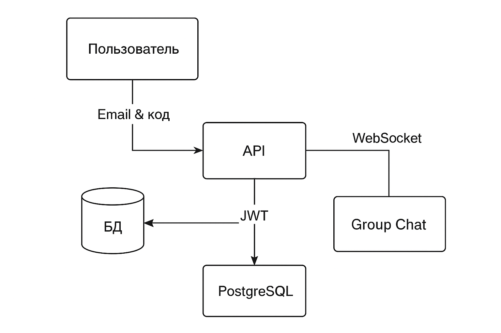
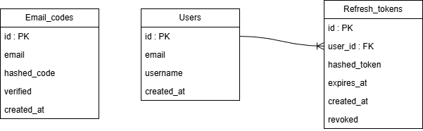

# Group Chat Application

Веб-приложение на FastAPI, позволяющее пользователям вести тематические переписки в групповых чатах. Перед тем как использовать функционал приложения, пользователь проходит аутентификацию с подтверждением кода, отправленного на указанный email. Проект является тренировочным и показывает мои навыки в backend-разработке.

## Схема работы сервиса

## Схема базы данных

